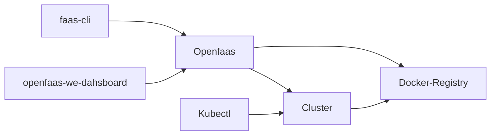
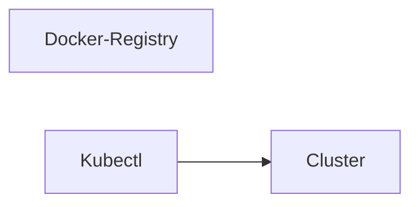
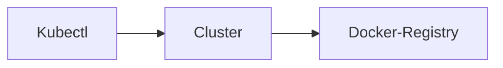
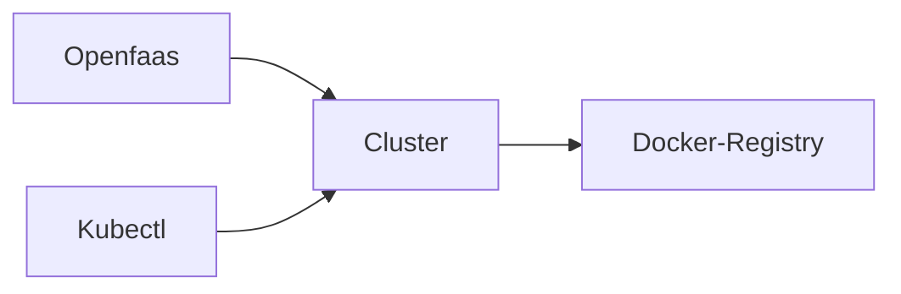

# Openfaas first steps

1. [Creating an openfaas local environment](#creating-an-openfaas-local-environment)
2. [Requirements](#requirements)
3. [Step one create a local docker registry service](#step-one-create-a-local-docker-registry-service)
4. [Step two create a local kubernetes cluster](#step-two-create-a-local-kubernetes-cluster)
5. [Step three, install openfaas](#step-three-install-openfaas)
6. [Step four install openfaas client faas-cli](#step-four-install-openfaas-client-faas-cli)
7. [Create your first function](#create-your-first-function)
8. [Useful related references](#useful-related-references)


## Creating an openfaas local environment

In order to create an openfaas environment let's start understanding how openfaas works, in this section let's have a quick overview.

Openfaas is a framework for creating and managing serverless functions agnostic of any cloud provider.

In this scenario, a function is a piece of code in charge of doing some task, the task can be anything really simple (like a hello world) or not so simple, but something well defined, usually having an input and output, and finally working by itself.

In openfaas a function can be built using different programming languages like python, nodejs, java, go, ruby, php, c#

Openfaas works creating and deploying functions as serverless on containers, such containers are deployed on pods in a kubernetes nodes cluster.

In the process of deploying a function openfaas will create an image of the function to be used to run the container.

So for our local setup we will work with kubernetes, docker and openfaas, this guide describes and explain the steps, at the end our environment will be like the following figure:



All the steps in this document were tested in ubuntu and mac, if you use windows you should make some research for equivalent tools or commands.

> :warning: **This guide** is intended **for developing,  testing or learning**: The environment resulting from this guide should be improved regarding security, **don't use it on live/production or exposed environments!**

## Requirements

Before starting you must install the following in your machine:

- Docker    https://docs.docker.com/engine/install/
- Go        https://go.dev/doc/install
- Kind      https://kind.sigs.k8s.io/docs/user/quick-start/
- kubectl   https://kubernetes.io/docs/tasks/tools/
- Arkade    https://anto.online/guides/kubernetes-how-to-install-arkade/


### Step one create a local docker registry service

This is the most basic `docker registry` deployment made easy in local, has no auth configuration.

```bash
docker pull registry:2
docker run -d --restart=always -p "5000:5000" --name "registrynoauth" registry:2
```

Important things to understand:
- Run the container with flag `--restart=always`, your registry will restart every time you restart your machine or docker service.
- Run the container assigning a name, in this case `registrynoauth`, this name will used to link this service to the cluster.

### Step two create a local kubernetes cluster

We will use ´kind´ to make this really easy

```bash
cat <<EOF | kind create cluster --name localcluster --config=-
kind: Cluster
apiVersion: kind.x-k8s.io/v1alpha4
nodes:
- role: control-plane
- role: worker
- role: worker
containerdConfigPatches:
- |-
  [plugins."io.containerd.grpc.v1.cri".registry.mirrors."localhost:5000"]
    endpoint = ["http://registrynoauth:5000"]
EOF
```

Important things to understand:
- This create a cluster with three nodes: a `control-plane`, and two `workers`
- The name os the cluster is `localcluster`
- The patch passed to the `containerdConfigPatches` add a mirror for the registries, our registry created on step one
- `kind` already update kubectl config to work with our new cluster.
- `Kind` created a cluster running inside docker containers, if you check at this point your containers running you should find 4 containters from the steps sofar, three for the cluster and one for the docker registry.

Our environment figure now looks like:


You can verify your cluster now exists
```bash
kind get clusters
localcluster  # this should be the output
```

Now add the registry container to the cluster network, so the cluster can connect to our local registry, at his moment kind created a docker network named `kind` add our registry to it

```bash
docker network connect "kind" "registrynoauth"
```

Also add an anotation on each cluster node to add a registry value
```bash
kind get nodes --name localcluster # lets get our cluster nodes list
# will appear something like
#   localcluster-worker
#   localcluster-worker2
#   localcluster-control-plane

# For each of the nodes run
#    kubectl annotate node NODE_NAME kind.x-k8s.io/registry=localhost:5000
kubectl annotate node localcluster-control-plane kind.x-k8s.io/registry=localhost:5000
kubectl annotate node localcluster-worker kind.x-k8s.io/registry=localhost:5000
kubectl annotate node localcluster-worker2 kind.x-k8s.io/registry=localhost:5000
```

Our environment figure now looks like:


### Step three, install openfaas

For this let's use Arkade to install openfaas, is so simple as running:

```bash
arkade install openfaas
```

Important things to understand:
- Openfaas is installed, `arkade` read the `kubeconfig` file so the installation is made on our cluster created in the step two
- This command will produce a large output, some lines in this output are commands we should run to complete our installation
- The stuff in the cluster related to openfaas are in the namespace `openfaas`

We can check in cluster the openfaas: nodes, deployments, pods
```bash
kubectl get nodes -n openfaas # -n flag is for namespace
kubectl get deployments -n openfaas
kubectl get pods -n openfaas
```

Let's execute the following important commands, this will forward the gateway to our localhost on port 8080, allowing interact with openfaas via localhost:8080

```bash
kubectl rollout status -n openfaas deploy/gateway  # this could take a while
kubectl port-forward -n openfaas svc/gateway 8080:8080 &
```

Our environment figure now looks like:


### Step four install openfaas client `faas-cli`

The openfaas command client is the tool we will be using for create and managing our functions!

Run the command (require sudo auth):
```bash
curl -SLsf https://cli.openfaas.com | sudo sh
```

Now we need to connect faas-cli to our openfaas cluster, we will get the password using the kubectl command `get secret` and use it to login with the command `faas-cli login`
```bash
PASSWORD=$(kubectl get secret -n openfaas basic-auth -o jsonpath="{.data.basic-auth-password}" | base64 --decode; echo)
echo -n $PASSWORD | faas-cli login --username admin --password-stdin
```

Important things to understand:
- The default username is `admin`
- Using username `admin` and the password from the previous command we can login in the web dashboard going to `http://localhost:8080/ui`

Our environment figure now looks like:


Which is the same figure we expected at the begining of these steps, so our environment is ready!!


## Create your first function

Now let's create a first function, using the `faas-cli` tool
```bash
# suggested create a folder for this
mkdir myfunction
cd myfunction
faas-cli new hello-name --lang python3-debian # or another language
```

Important things to understand:
- This created a new function which includes (*this apply for python lang*)
  - A yaml file named as the function name `hello-name.yaml`, in this file there are some settings for our function, we can change values or add more settings [reference](https://docs.openfaas.com/reference/yaml/)
  - A folder named as the function name `hello-name`
  - In the folder, a `handler.py` file, this is where we should write our code inside in the `handle` function
  - In the folder, a `requirements.txt` file, to add dependencies required and to be installed using `pip`

Now edit the `hello-name/handler.py` file like this:

```python
def handle(req):
    """handle a request to the function
    Args:
        req (str): request body
    """

    return f"Hello {req}!"
```

In the `hello-name.yml` file edit the `image` adding the prefix `localhost:5000` to indicate we are using our local registry on por 5000
```yaml
..... # other stuff
    image: localhost:5000/hello-name:latest
```

Now let's deploy the function, to deploy there are three steps:
```bash
# build the container, (behind scene this is a docker build)
faas-cli build -f hello-name.yml
# upload the image to the registry, (behind scene... yet this is a docker push)
faas-cli push -f hello-name.yml
# deploy the function in our cluster!!!
faas-cli deploy -f hello-name.yml
```

All the three command can be done in one using the `up` command, but is good to know step by step in case on errors we can debug the proccess better ;)
```bash
faas-cli up -f hello-name.yml
```

Now our function should be deployed and ready to be invoked, there are three ways to invoke a function:
- Via curl (clients like postman can be used to make easy sending complex parameters like json or for testing purposes):
```bash
curl http://127.0.0.1:8080/function/hello-name -d "Pedro"
```
- Using the `invoke` button in the dahsboard (*localhost:8080/ui/*)
- Using the `invoke` option on the `faas-cli` command, this will prompt data from STDIN
```bash
faas-cli invoke hello-name
```

In any of the cases, and supposing the parameter sent was 'Pedro' the output/response will be:

`Hello Pedro!`


Another useful `faas-cli` commands:
```bash
faas-cli list  # lists deployed functions
faas-cli invoke `FUNC_NAME` # invokes a function, it will read input string from STDIN
faas-cli logs `FUNC_NAME` # shows log traces from container where function is running
faas-cli describe `FUNC_NAME` # describe an overview of a function
```

Once you start deploying function, have in mind in the cluster all the functions stuff are in the namespace `openfaas-fn`, this can be really helpful to know because sometimes deploy functions could fail due to different causes, and then you cann't check the logs using `faas-cli logs`, in those cases you can check the state of the pods to determine posible errors and find a solution.

```bash
kubectl get pods -n openfaas-fn
kubectl describe pod `POD_NAME` -n openfaas-fn
```

In the file `create-cluster.sh` you will find a bash script to run all the steps at once, I suggest to use it after reading and have a good understanding of all of the steps explained in this guide.
```bash
bash create-cluster.sh
```

## Useful related references
- https://blog.alexellis.io/get-started-with-openfaas-and-kind/
- https://mickey.dev/posts/getting-started-with-openfaas/
- https://mcvidanagama.medium.com/set-up-a-multi-node-kubernetes-cluster-locally-using-kind-eafd46dd63e5
- https://kind.sigs.k8s.io/docs/user/local-registry/
- https://docs.docker.com/registry/deploying/
- https://docs.openfaas.com/deployment/troubleshooting
